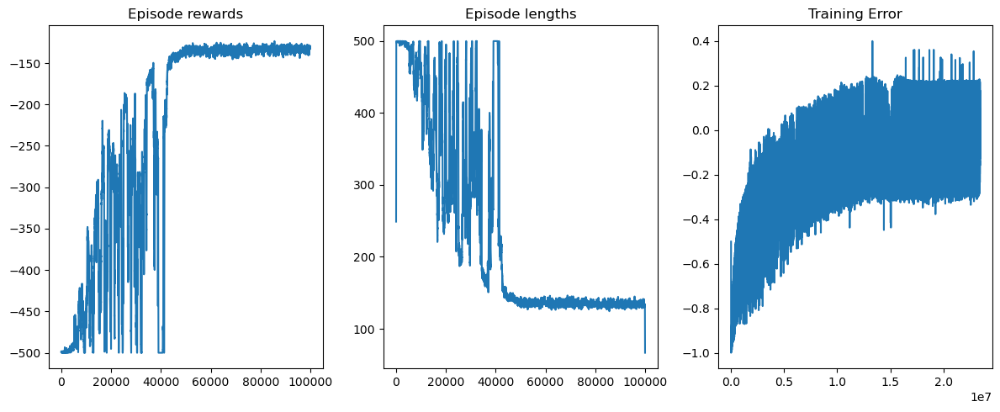

# Analisis de resultados
## Metodologia

Dado que hay una serie de factores en juego cuyo impacto se desconoce, la idea es tener un punto de partida
para ir explorando un poco.

Los valores que iran fijos en estos experimentos, van a ser la cantidad de bins(3 por percept), cantidad de episodios(10 mil) y factor de descuento(0.95).

*Primer experimento*

| Parametro       | Valor |         
|-----------------|-------|
| Epsilon inicial |  1.0  |
| Epsilon final   |  0.1  |
| Learning rate   |  0.01 |

Tiempo de entrenamiento: 4:26

Entrenamiento:

Benchmark:

Los resultados son interesantes, pero nos interesaria reducir la variabilidad
en lo que es el entrenamiento, dado que se pueden percibir picos bajisimos de reward
cerca de las 10mil iteraciones.

*Segundo experimento*

Para intentar reducir la variabilidad en las recompensas a medida que aprende,
se reduce el epsilon final a 0.01 con la esperanza de reducir la variabilidad.

| Parametro       | Valor |         
|-----------------|-------|
| Epsilon inicial |  1.0  |
| Epsilon final   |  0.01 |
| Learning rate   |  0.01 |

Tiempo de entrenamiento: 4:29

Entrenamiento:

Benchmark:

Logramos que converjan los valores pero a costo de un agente que benchmarkea peor
vamos a intentar de reducir la exploracion inicial a ver si eso mejora.

*Tercer experimento*

| Parametro       | Valor |         
|-----------------|-------|
| Epsilon inicial |  0.5  |
| Epsilon final   |  0.01 |
| Learning rate   |  0.01 |

Tiempo de entrenamiento: 2:51

Entrenamiento:

Benchmark:

Logramos que converjan los valores pero hay algo raro al final, vamos a ver si aumentando el learning rate se pueden mejorar los resultados.

*Cuarto experimento*
100k iteraciones
Para este experimento, se modificaron los valores y se llego a un tiempo de entrenamiento de media hora, pero sin mejorar demasiado la performance por lo cual ahora queda solamente ir por los bins.

| Parametro       | Valor |         
|-----------------|-------|
| Epsilon inicial |  1.0  |
| Epsilon final   |  0.001 |
| Learning rate   |  0.001 |

Entrenamiento:

Benchmark:

*Quinto experimento*
10k iteraciones
bins 2xn

originales valores

| Parametro       | Valor |         
|-----------------|-------|
| Epsilon inicial |  1.0  |
| Epsilon final   |  0.001 |
| Learning rate   |  0.001 |

============= LEARNING RATE ======================

El docente de practico me sugirio que intente replicar lo hecho con epsilon(inicial, final y decay) con el LR, para poder analizar el resultado que tiene sobre las graficas.

| Parametro             | Valor |         
|-----------------------|-------|
| Epsilon inicial       |  1.0  |
| Epsilon final         |  0.1  |
| Learning rate inicial |  1.0  |
| Learning rate final   |  0.01 |

Entrenamiento:

Benchmark:

Esto claramente tuvo un impacto positivo, se puede ver en las graficas que parece ser un poco mas lineal el tema de las rewards, ahora queda probar distintos valores.

*Segundo experimento*

Se prueba reducir aun mas el learning rate final

| Parametro             | Valor  |         
|-----------------------|--------|
| Epsilon inicial       |  1.0   |
| Epsilon final         |  0.1   |
| Learning rate inicial |  1.0   |
| Learning rate final   |  0.001 |

Entrenamiento:

Benchmark:

Bastante malos resultados, se va a probar varios cambios

*Tercer experimento*

Se prueba reducir el epsilon final

| Parametro             | Valor  |         
|-----------------------|--------|
| Epsilon inicial       |  1     |
| Epsilon final         |  0.001 |
| Learning rate inicial |  1     |
| Learning rate final   |  0.001 |

Entrenamiento:

Benchmark:

Claramente faltaba ajustar el epsilon final y reducir aun mas el learning rate

*Cuarto experimento*

Teniendo ya buenos resultados, se va a intentar reducir la cantidad de iteraciones para intentar optimizar aun mas el proceso con los siguientes hiperparams

| Parametro             | Valor  |         
|-----------------------|--------|
| Epsilon inicial       |  1     |
| Epsilon final         |  0.001 |
| Learning rate inicial |  1     |
| Learning rate final   |  0.001 |

Con 5k iteraciones nos acercamos a una policy optima, logrando casi el mismo resultado que con el doble de iteraciones:

