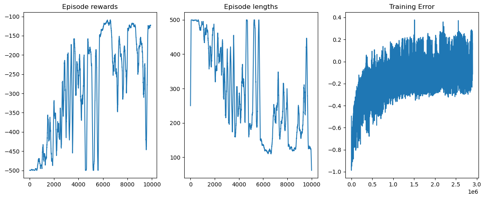
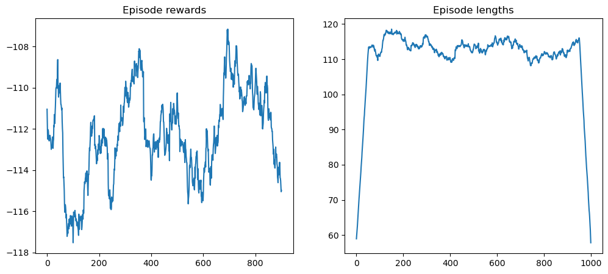

# Acrobot

## Abstract
Se logro resolver el problema utilizando Q learning. 

El proceso tuvo basicamente 3 etapas: 
- la primera buscando encontrar la cantidad correcta de bins
- la segunda intentando afinar los hiperparams hasta lograr buenos rendimientos en benchmarking
-  la tercera intentando perfeccionar los resultados alcanzados.

Los modelos se encuentran en la raiz con los notebooks, y se los puede probar utilizando el notebook ```/Acrobot/model_agent_benchmark.ipynb```.

## Acrobot

Para la resolucion del Acrobot, decidi primero resolver el tema de como implementar Q learning.

Siguiendo el tutorial(agregar link) logre implementar un agente que jugaba Blackjack. Fue un paso en la direccion correcta pero
aun quedaban cosas por resolver. La primera: el espacio de percepts posibles del Blackjack era discreto, mientras que el
del Acrobot continuo.

Partiendo de la base que habia obtenido resultados bastante buenos con los hiperparametros que sugeria la implementacion linkeada
pude experimentar con la distribucion de bins con la certeza de que la implementacion general del algoritmo era solida.
La primer decision que tome fue la de utilizar la misma cantidad de bins para todos los valores, dado que mas alla que algunos
tuvieran espacios mas amplios que otros, en principio todos tenian igual relevancia(aca hay una oportunidad de mejora a futuro, viendo
si se puede reducir en algun caso sin impactar el rendimiento overall, o aumentar pero si buscando impacto en el rendimiento).

Luego habia que decidir cuantos. Experimentando un poco encontre que el numero de 10mil iteraciones de entrenamiento eran un
tiempo razonable como para ver resultados sin hacer demasiado largo el experimento, por lo cual la cantidad de bins iba a tener
que ser compatible con este valor. 

Probe utilizando el notebook ```/Acrobot/bins_benchmark.ipynb``` con 2, 3 y 4 bins, utilizando los hiperparametros de la tabla y arrojando los siguientes resultados:

| Parametro       | Valor |         
|-----------------|-------|
| Cant iteraciones| 10_000|
| Epsilon inicial |  1.0  |
| Epsilon final   |  0.01 |
| Learning rate   |  0.01 |
| Factor descuento|  0.95 |


### 2 bins

### 3 bins

### 4 bins


Claramente la mejor opcion es 3, y es importante aclarar que esto va de la mano con los hiperparametros que use para el benchmarking
si por ejemplo entrenara con 1_000_000 iteraciones podria alcanzar resultados similares con 4 bins.

Habiendo definido esto, resta experimentar con los hiperparametros para optimizar el proceso de aprendizaje.

## Experimentos hiperparams

Los experimentos fueron realizados utilizando el notebook ```/Acrobot/model_initial_training.ipynb``` para entrenamiento y
```/Acrobot/model_agent_benchmark.ipynb```.

En los siguientes experimentos fue usada esta configuracion:

| Parametro       | Valor |         
|-----------------|-------|
| Cant iteraciones| 10_000|
| Factor descuento|  0.95 |


### Primer experimento

| Parametro       | Valor |         
|-----------------|-------|
| Epsilon inicial |  1.0  |
| Epsilon final   |  0.1  |
| Learning rate   |  0.01 |

Tiempo de entrenamiento: 4:26

**Entrenamiento**


**Benchmark**


Los resultados son interesantes, pero nos interesaria reducir la variabilidad en el entrenamiento, dado que se pueden percibir picos bajisimos de reward cerca de las 10mil iteraciones.

### Segundo experimento

Para intentar reducir la variabilidad en las recompensas a medida que aprende,
se reduce el epsilon final a 0.01 con la esperanza de reducir la variabilidad.

| Parametro       | Valor |         
|-----------------|-------|
| Epsilon inicial |  1.0  |
| Epsilon final   |  0.01 |
| Learning rate   |  0.01 |

Tiempo de entrenamiento: 4:29

**Entrenamiento**


**Benchmark**


Logramos que converjan los valores pero a costo de un agente que benchmarkea peor, vamos a intentar de reducir la exploracion inicial a ver si eso mejora.

### Tercer experimento

| Parametro       | Valor |         
|-----------------|-------|
| Epsilon inicial |  0.5  |
| Epsilon final   |  0.01 |
| Learning rate   |  0.01 |

Tiempo de entrenamiento: 2:51

**Entrenamiento**


**Benchmark**


Logramos que converjan los valores pero hay algo raro al final, vamos a ver si aumentando el learning rate se pueden mejorar los resultados.

### Cuarto experimento
Para el ultimo experimento se decide utilizar epsilon final y learning rate mas bajos, pero aumentar x10 la cantidad de iteraciones,
quedando los valores para esta ejecucion como detalla la siguiente tabla:

| Parametro       | Valor  |         
|-----------------|--------|
| Cant iteraciones| 100_000|
| Epsilon inicial |  1.0   |
| Epsilon final   |  0.001 |
| Learning rate   |  0.001 |

**Entrenamiento**


**Benchmark**


No se logra el resultado buscado, se decide consultar al docente de practico como proseguir dado que no pude estabilizar tanto el
aprendizaje como el benchmarking en conjunto.

## Experimentos con learning rate


El docente de practico me sugirio que intente replicar lo hecho con epsilon(inicial, final y decay) con el LR, para poder analizar el resultado que tiene sobre los experimentos.

Se mantienen los mismos valores base que en el caso anterior, es decir los siguientes:

| Parametro       | Valor |         
|-----------------|-------|
| Cant iteraciones| 10_000|
| Factor descuento|  0.95 |

Se utiliza el mismo ipynb para el benchmarking, pero para el entrenamiento se utiliza una version modificada del algoritmo anterior,
la cual se encuentra en ```/Acrobot/model_training.ipynb```

### Primer experimento


| Parametro             | Valor |         
|-----------------------|-------|
| Epsilon inicial       |  1.0  |
| Epsilon final         |  0.1  |
| Learning rate inicial |  1.0  |
| Learning rate final   |  0.01 |

**Entrenamiento**


**Benchmark**


Esto claramente tuvo un impacto positivo, se puede ver en las graficas que parece ser un poco mas lineal el tema de las rewards, ahora queda probar distintos valores.

## Segundo experimento

Se prueba reducir aun mas el learning rate final

| Parametro             | Valor  |         
|-----------------------|--------|
| Epsilon inicial       |  1.0   |
| Epsilon final         |  0.1   |
| Learning rate inicial |  1.0   |
| Learning rate final   |  0.001 |


**Entrenamiento**


**Benchmark**


Bastante malos resultados, se va a probar varios cambios

## Tercer experimento

Se prueba reducir el epsilon final

| Parametro             | Valor  |         
|-----------------------|--------|
| Epsilon inicial       |  1     |
| Epsilon final         |  0.001 |
| Learning rate inicial |  1     |
| Learning rate final   |  0.001 |

Entrenamiento:


Benchmark:


Finalmente se logran los objetivos buscados, es decir, un aprendizaje mas lineal y buen benchmarking.

Habiendo alcanzado esto, decidi ver si los resultados se mantenian al reducir la cantidad de iteraciones a 5mil.

## Cuarto experimento

| Parametro             | Valor  |         
|-----------------------|--------|
| Epsilon inicial       |  1     |
| Epsilon final         |  0.001 |
| Learning rate inicial |  1     |
| Learning rate final   |  0.001 |


**Entrenamiento**


**Benchmark**


Efectivamente, al agregarle el efecto de decay al learning rate mejora muchisimo la capacidad de aprendizaje del agente, reduciendo
la cantidad de iteraciones necesarias para lograr un buen resultado. Se podria ahora por ejemplo probar con 4 bins, que antes
no era viable dada la cantidad de iteraciones con las cuales se pretendia entrenar.