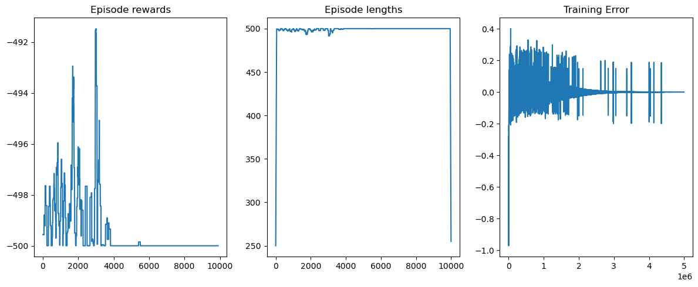
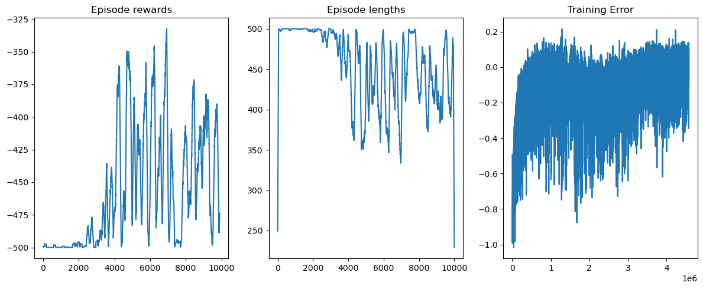
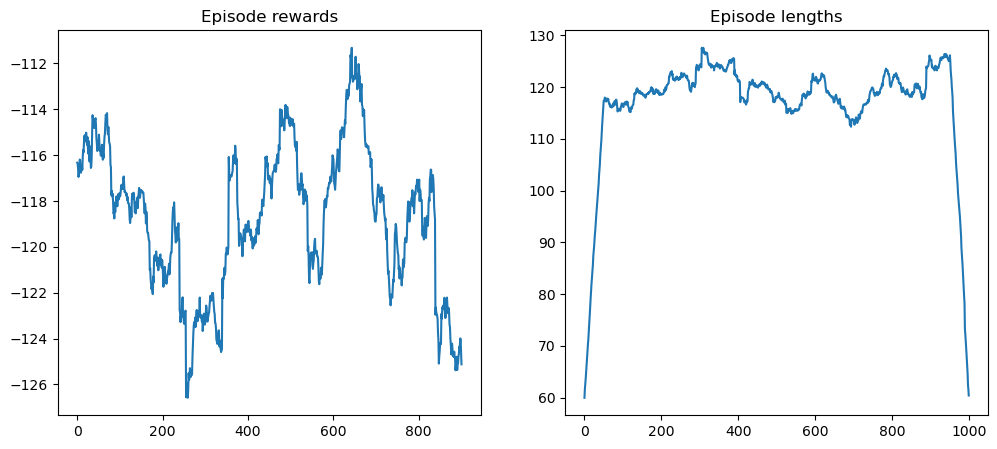
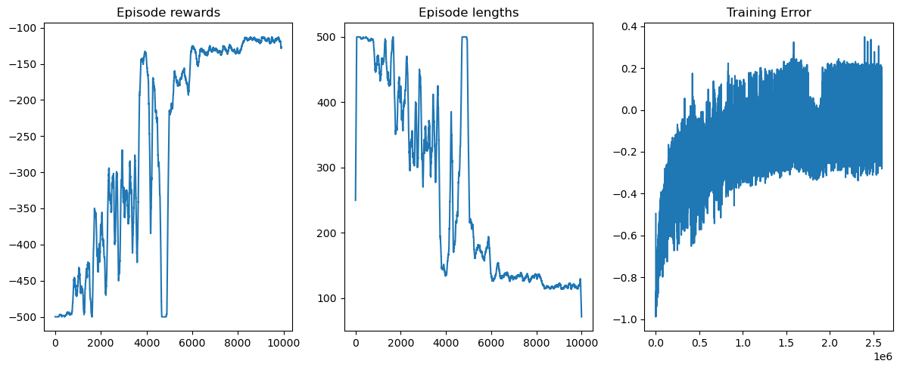
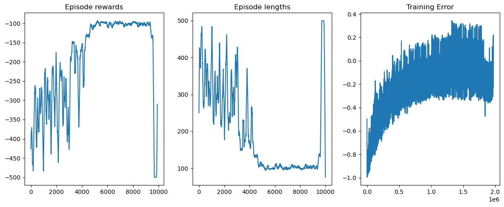
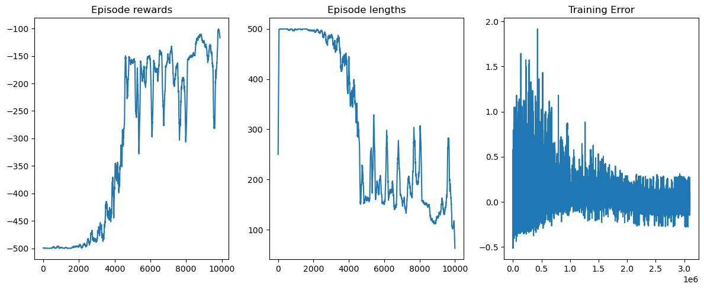
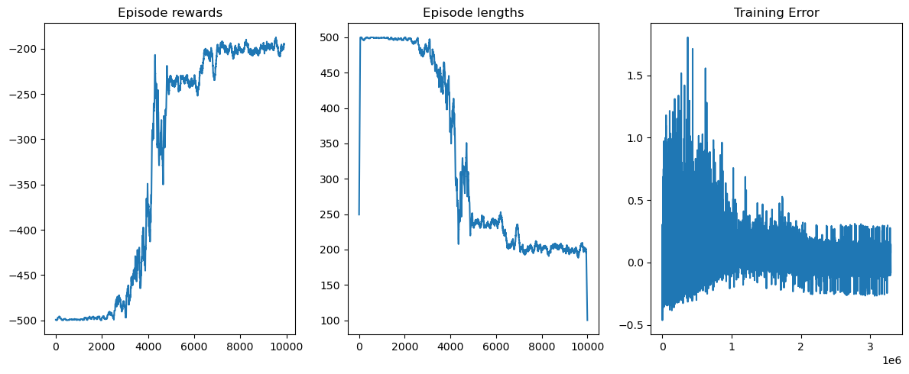
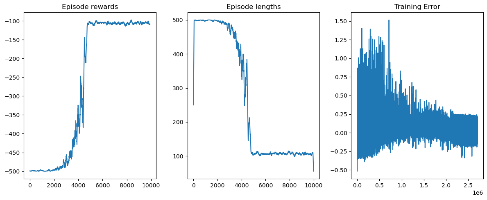
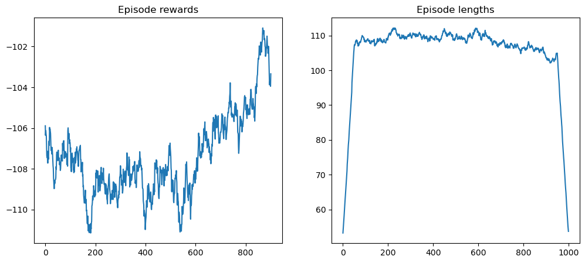

# Informe

Juan Pablo Sobral - 192247

Se aplicaron las tecnicas de Q learning y minimax para alcanzar agentes con buenos rendimientos en ambos problemas.

A continuacion se detallan los procesos en cada caso.

# Acrobot

## Abstract
Se logro resolver el problema utilizando Q learning. 

El proceso tuvo basicamente 3 etapas: 
- la primera buscando encontrar la cantidad correcta de bins
- la segunda intentando afinar los hiperparams hasta lograr buenos rendimientos en benchmarking
-  la tercera intentando perfeccionar los resultados alcanzados.

Los modelos se encuentran en la raiz con los notebooks, y se los puede probar utilizando el notebook ```/Acrobot/model_agent_benchmark.ipynb```.

## Acrobot

Para la resolucion del Acrobot, decidi primero resolver el tema de como implementar Q learning.

Siguiendo el tutorial(agregar link) logre implementar un agente que jugaba Blackjack. Fue un paso en la direccion correcta pero
aun quedaban cosas por resolver. La primera: el espacio de percepts posibles del Blackjack era discreto, mientras que el
del Acrobot continuo.

Partiendo de la base que habia obtenido resultados bastante buenos con los hiperparametros que sugeria la implementacion linkeada
pude experimentar con la distribucion de bins con la certeza de que la implementacion general del algoritmo era solida.
La primer decision que tome fue la de utilizar la misma cantidad de bins para todos los valores, dado que mas alla que algunos
tuvieran espacios mas amplios que otros, en principio todos tenian igual relevancia(aca hay una oportunidad de mejora a futuro, viendo
si se puede reducir en algun caso sin impactar el rendimiento overall, o aumentar pero si buscando impacto en el rendimiento).

Luego habia que decidir cuantos. Experimentando un poco encontre que el numero de 10mil iteraciones de entrenamiento eran un
tiempo razonable como para ver resultados sin hacer demasiado largo el experimento, por lo cual la cantidad de bins iba a tener
que ser compatible con este valor. 

Probe utilizando el notebook ```/Acrobot/bins_benchmark.ipynb``` con 2, 3 y 4 bins, utilizando los hiperparametros de la tabla y arrojando los siguientes resultados:

| Parametro       | Valor |         
|-----------------|-------|
| Cant iteraciones| 10_000|
| Epsilon inicial |  1.0  |
| Epsilon final   |  0.01 |
| Learning rate   |  0.01 |
| Factor descuento|  0.95 |


### 2 bins

### 3 bins

### 4 bins


Claramente la mejor opcion es 3, y es importante aclarar que esto va de la mano con los hiperparametros que use para el benchmarking
si por ejemplo entrenara con 1_000_000 iteraciones podria alcanzar resultados similares con 4 bins.

Habiendo definido esto, resta experimentar con los hiperparametros para optimizar el proceso de aprendizaje.

## Experimentos hiperparams

Los experimentos fueron realizados utilizando el notebook ```/Acrobot/model_initial_training.ipynb``` para entrenamiento y
```/Acrobot/model_agent_benchmark.ipynb```.

En los siguientes experimentos fue usada esta configuracion:

| Parametro       | Valor |         
|-----------------|-------|
| Cant iteraciones| 10_000|
| Factor descuento|  0.95 |


### Primer experimento

| Parametro       | Valor |         
|-----------------|-------|
| Epsilon inicial |  1.0  |
| Epsilon final   |  0.1  |
| Learning rate   |  0.01 |

Tiempo de entrenamiento: 4:26

**Entrenamiento**


**Benchmark**


Los resultados son interesantes, pero nos interesaria reducir la variabilidad en el entrenamiento, dado que se pueden percibir picos bajisimos de reward cerca de las 10mil iteraciones.

### Segundo experimento

Para intentar reducir la variabilidad en las recompensas a medida que aprende,
se reduce el epsilon final a 0.01 con la esperanza de reducir la variabilidad.

| Parametro       | Valor |         
|-----------------|-------|
| Epsilon inicial |  1.0  |
| Epsilon final   |  0.01 |
| Learning rate   |  0.01 |

Tiempo de entrenamiento: 4:29

**Entrenamiento**


**Benchmark**


Logramos que converjan los valores pero a costo de un agente que benchmarkea peor, vamos a intentar de reducir la exploracion inicial a ver si eso mejora.

### Tercer experimento

| Parametro       | Valor |         
|-----------------|-------|
| Epsilon inicial |  0.5  |
| Epsilon final   |  0.01 |
| Learning rate   |  0.01 |

Tiempo de entrenamiento: 2:51

**Entrenamiento**


**Benchmark**


Logramos que converjan los valores pero hay algo raro al final, vamos a ver si aumentando el learning rate se pueden mejorar los resultados.

### Cuarto experimento
Para el ultimo experimento se decide utilizar epsilon final y learning rate mas bajos, pero aumentar x10 la cantidad de iteraciones,
quedando los valores para esta ejecucion como detalla la siguiente tabla:

| Parametro       | Valor  |         
|-----------------|--------|
| Cant iteraciones| 100_000|
| Epsilon inicial |  1.0   |
| Epsilon final   |  0.001 |
| Learning rate   |  0.001 |

**Entrenamiento**


**Benchmark**


No se logra el resultado buscado, se decide consultar al docente de practico como proseguir dado que no pude estabilizar tanto el
aprendizaje como el benchmarking en conjunto.

## Experimentos con learning rate


El docente de practico me sugirio que intente replicar lo hecho con epsilon(inicial, final y decay) con el LR, para poder analizar el resultado que tiene sobre los experimentos.

Se mantienen los mismos valores base que en el caso anterior, es decir los siguientes:

| Parametro       | Valor |         
|-----------------|-------|
| Cant iteraciones| 10_000|
| Factor descuento|  0.95 |

Se utiliza el mismo ipynb para el benchmarking, pero para el entrenamiento se utiliza una version modificada del algoritmo anterior,
la cual se encuentra en ```/Acrobot/model_training.ipynb```

### Primer experimento


| Parametro             | Valor |         
|-----------------------|-------|
| Epsilon inicial       |  1.0  |
| Epsilon final         |  0.1  |
| Learning rate inicial |  1.0  |
| Learning rate final   |  0.01 |

**Entrenamiento**


**Benchmark**


Esto claramente tuvo un impacto positivo, se puede ver en las graficas que parece ser un poco mas lineal el tema de las rewards, ahora queda probar distintos valores.

## Segundo experimento

Se prueba reducir aun mas el learning rate final

| Parametro             | Valor  |         
|-----------------------|--------|
| Epsilon inicial       |  1.0   |
| Epsilon final         |  0.1   |
| Learning rate inicial |  1.0   |
| Learning rate final   |  0.001 |


**Entrenamiento**


**Benchmark**


Bastante malos resultados, se va a probar varios cambios

## Tercer experimento

Se prueba reducir el epsilon final

| Parametro             | Valor  |         
|-----------------------|--------|
| Epsilon inicial       |  1     |
| Epsilon final         |  0.001 |
| Learning rate inicial |  1     |
| Learning rate final   |  0.001 |

Entrenamiento:


Benchmark:


Finalmente se logran los objetivos buscados, es decir, un aprendizaje mas lineal y buen benchmarking.

Habiendo alcanzado esto, decidi ver si los resultados se mantenian al reducir la cantidad de iteraciones a 5mil.

## Cuarto experimento

| Parametro             | Valor  |         
|-----------------------|--------|
| Epsilon inicial       |  1     |
| Epsilon final         |  0.001 |
| Learning rate inicial |  1     |
| Learning rate final   |  0.001 |


**Entrenamiento**


**Benchmark**


Efectivamente, al agregarle el efecto de decay al learning rate mejora muchisimo la capacidad de aprendizaje del agente, reduciendo
la cantidad de iteraciones necesarias para lograr un buen resultado. Se podria ahora por ejemplo probar con 4 bins, que antes
no era viable dada la cantidad de iteraciones con las cuales se pretendia entrenar.

# Isolation

# Algoritmo
Se eligio implementar minimax dado que no hay aleatoriedad mas alla de la posicion inicial, y esa posicion inicial es a partir de la cual
se puede arrancar a analizar las decisiones que tome el agente.

El agente final utilizado fue ```final_agent.py``` y se jugo en ```isolation.ipynb```.

El agente logro un buen winrate con una profundidad de 2 movimientos (1 propio y 1 del oponente), logrando matchear el rendimiento de Stratagem con un runtime
de un tercio (12m 1000 jugadas agent vs stratagem, comparado con 35m 1000 jugadas stratagem vs agent).

Se probo tambien aumentar la profundidad en 1, simplemente para ver en igualdad de condiciones en cuanto al tiempo (mi agente es mas rapido) que tanta ventaja
podiamos obtener. Dado que no se estaba utilizando pruning, el tiempo de ejecucion resulto altisimo y no se presento una ganancia en rendimiento, por lo cual quedo descartado.

Luego se experimento con alfa beta pruning, pero los arboles no son tan altos como para ameritarlo. No logre que rinda igual que el agente que mira 2 movimientos
ni aumentando la profundidad a 6. Tal vez fue un problema de mi implementacion, pero me dio la impresion que estaba descartando ramas que no deberia, porque
rendia peor que un agente con un tercio de la profundidad pero sin pruning.

En conclusion, se logro una implementacion de minimax satisfactoria, creo que el exito estuvo en la buena calibracion de las heuristicas para luego ya 
dedicarme al tuneo del minimax.

# Heuristica

Para establecer la heuristica a utilizar se realizo benchmarking, utilizando una version modificada del agente final vs el Stratagem jugando 1000 partidas.
Se utilizo el notebook ```heuristic_test.ipynb``` en el cual se usa una funcion que cree para estos propositos: ```play_vs_other_agent_and_accumulate_results```.
El agente benchmarkeado es HeuristicAgent.

Se realiza minimax con profundidad 0, es decir, se realiza una accion y se evalua la heuristica, y se toma la mejor accion en funcion de eso.
Esto nos permitio experimentar bastante con la heuristica antes de comprometernos a una.

## Primer componente

La primer cosa a determinar es si vale la pena separar los movimientos de las acciones, es decir, si podemos tomar los movimientos como un componente separado que 
las destrucciones en la funcion de evaluacion.

### Rendimiento con acciones

``` py
def heuristic_utility(self, board):
        player_actions = board.get_possible_actions(self.player)
        board_actions = board.get_possible_actions(self.board)
        return (player_actions.__len__() - board_actions.__len__())
```

| Parametro       | Valor |         
|-----------------|-------|
| Cant iteraciones| 1000  |
| Winrate         |  32.5%|
| Runtime         |  13min|

### Rendimiento con movimientos

``` py
def heuristic_utility(self, board):
        player_actions = board.get_possible_actions(self.player)
        board_actions = board.get_possible_actions(self.board)
        player_moves = self.split_actions(player_actions).keys().__len__()
        board_moves = self.split_actions(board_actions).keys().__len__()
        return (player_moves - board_moves)
```

| Parametro       | Valor |         
|-----------------|-------|
| Cant iteraciones| 1000  |
| Winrate         |  34.7%|
| Runtime         |  12min|


Conclusion, vale mas la pena guiarse solamente por los movimientos posibles que por las acciones totales (lo cual tiene sentido).

## Segundo componente

Se hablo con el profe de practico en busqueda de mejorar la heuristica, y nos sugirio la distancia al centro como un potencial componente extra.
En lugar de calcular la distancia al centro en si, decidi dar un bonus si se encontraba en alguna de las 4 posiciones centrales ((1,1)(1,2),(2,2),(2,1)).

Se decidio tambien benchmarkear esta heuristica sola, no se espera que sea tan buena como la anterior simplemente un extra para que rinda aun mejor.

```py
def heuristic_utility(self, board):
        player_col, player_row = board.find_player_position(self.player)
        board_col, board_row = board.find_player_position(self.board)
        player_pos_bonus, board_pos_bonus = 0, 0
        if player_col == 1 or player_col == 2:
            player_pos_bonus += 2
        if player_row == 1 or player_row == 2:
            player_pos_bonus += 2
        if board_col == 1 or board_col == 2:
            board_pos_bonus += 2
        if board_row == 1 or board_row == 2:
            board_pos_bonus += 2
        return (player_pos_bonus - board_pos_bonus)
```

Los resultados fueron los siguientes:

| Parametro       | Valor |         
|-----------------|-------|
| Cant iteraciones| 1000  |
| Winrate         |  32.2%|
| Runtime         |  12min|

Alentadores, tenemos nuestro segundo compoente para la heuristica

## Heuristica final

Para definir la heuristica final, seguimos experimentando con heuristic_agent, la idea es determinar los pesos, partiendo de 1, 1

```py
def heuristic_utility(self, board):
        player_col, player_row = board.find_player_position(self.player)
        board_col, board_row = board.find_player_position(self.board)
        player_actions = board.get_possible_actions(self.player)
        board_actions = board.get_possible_actions(self.board)
        player_moves = self.split_actions(player_actions).keys().__len__()
        board_moves = self.split_actions(board_actions).keys().__len__()
        player_pos_bonus, board_pos_bonus = 0, 0
        if player_col == 1 or player_col == 2:
            player_pos_bonus += 2
        if player_row == 1 or player_row == 2:
            player_pos_bonus += 2
        if board_col == 1 or board_col == 2:
            board_pos_bonus += 2
        if board_row == 1 or board_row == 2:
            board_pos_bonus += 2
        return (player_moves - board_moves) + (player_pos_bonus - board_pos_bonus)
```

Los resultados fueron los siguientes:

| Parametro       | Valor |         
|-----------------|-------|
| Cant iteraciones| 1000  |
| Winrate         |  32.6%|
| Runtime         |  12min|

Se prueba con pesos 1, 0.75 

Los resultados fueron los siguientes:

| Parametro       | Valor |         
|-----------------|-------|
| Cant iteraciones| 1000  |
| Winrate         |  32.1%|
| Runtime         |  12min|

Se prueba con pesos 1, 0.5 

Los resultados fueron los siguientes:

| Parametro       | Valor |         
|-----------------|-------|
| Cant iteraciones| 1000  |
| Winrate         |  34.6%|
| Runtime         |  12min|

Buenos resultados, comparables a los conseguidos con 1 de los componentes de la heuristica en el mejor caso obtenido.
Ultima prueba con pesos 1, 0.25 dado que la reduccion del peso del componente de posicion fue positiva

| Parametro       | Valor |         
|-----------------|-------|
| Cant iteraciones| 1000  |
| Winrate         |  32.5%|
| Runtime         |  12min|

Dada la reduccion en performance vamos a mantener el peso del segundo componente en 0.5, tambien podriamos reducir el bonus a +1 y alcanzar el mismo resultado.

# Niveles
Teniendo seleccionados los componentes y peso para la heuristica, corresponde aumentar la cantidad de niveles que se van a analizar.

Se va a benchmarkear utilizando el notebook ```isolation.ipynb``` y el agente ```final_agent.py``` vs Stratagem, pero con una nueva metodologia.
Dado que el ir primero o segundo tiene un impacto tangible sobre los resultados, se van a ejecutar 1000 partidas con el agente yendo primero y 1000 partidas con el agente yendo segundo.

### 2 niveles

2 niveles quiere decir que el agente revisa los potenciales movimientos del oponente. Es decir, dado un estado, simula un movimiento y luego simula tambien 
la respuesta del oponente a ese movimiento.

Los resultados fueron los siguientes:

| Parametro       | Valor |         
|-----------------|-------|
| Winrate primero |  69.4%|
| Runtime primero |  12min|
| Winrate segundo |  30.8%|
| Runtime segundo |  35min|

Bueno, nuestro agente es objetivamente mejor que el agente contra el que competimos, dado que el winrate promediado entre primero y segundo es apenas mayor
a 50%. Podriamos dar por terminado el ejercicio pero vamos a benchmarkear tambien 2 niveles. Solamente quiero ver cuanto mejor puede hacer rendir a mi agente 
yendo primero, dado que basandome en el runtime de este experimento anterior, yendo segundo seguramente este 1h o mas.


### 3 niveles

Ahora el agente proyecta 1 jugada mas alla de la respuesta del oponente al movimiento inicial.

Los resultados fueron los siguientes:

| Parametro       | Valor |         
|-----------------|-------|
| Winrate primero |  67.9%|
| Runtime primero |  90min|

Sorprendentemnete los resultados no solamente no mejoraron si no que empeoraron, y el tiempo de ejecucion es altisimo tambien, por lo cual no se va a utilizar
esta cantidad de niveles